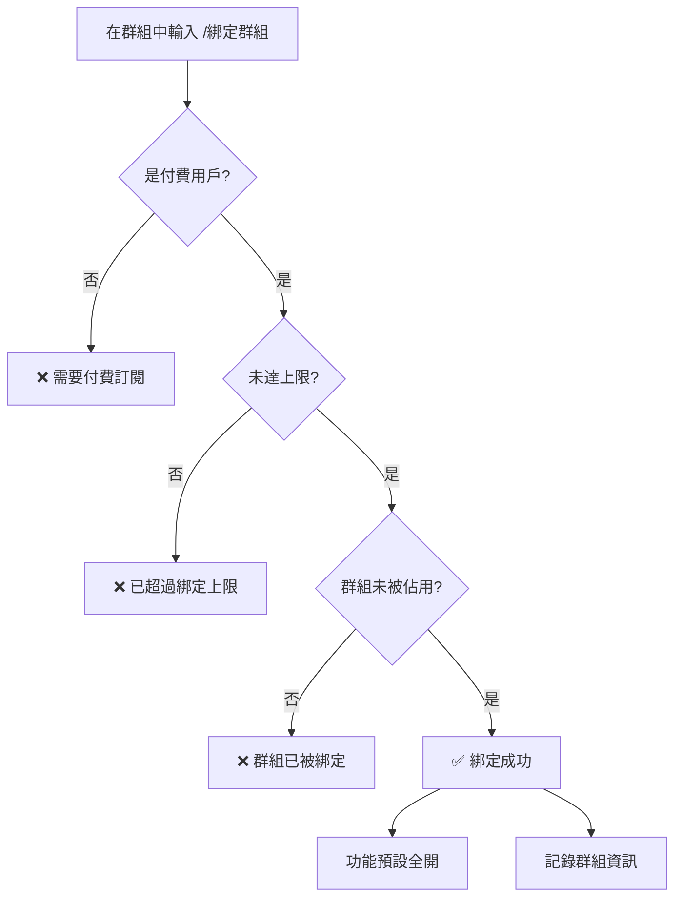
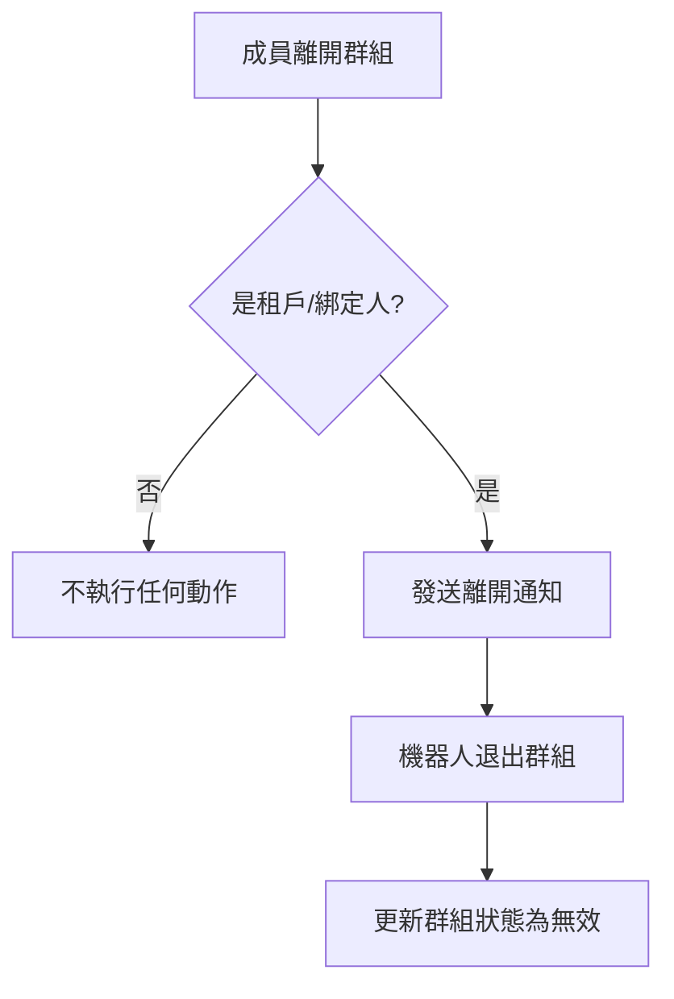

# 🎯 新功能快速參考

## 新增指令

| 指令 | 權限 | 功能 | 範例 |
|------|------|------|------|
| `/管理員選單` | 主人/白名單 | 查看租戶詳細資訊 | `/管理員選單` |
| `/設定群組上限 @用戶 數量` | 主人 | 設定租戶群組上限 | `/設定群組上限 @小明 50` |
| `/移轉權限 @用戶` | 付費用戶/主人 | 移轉訂閱給其他人 | `/移轉權限 @新用戶` |
| `/綁定群組` | 付費用戶 | 綁定當前群組 | `/綁定群組` |

## 管理員選單顯示

### 在群組中
```
🎛️ 租戶管理面板

【租戶基本資訊】
👤 名稱: 翻翻君11
📊 狀態: 🟢 啟用中
📅 到期日: 2026-07-09
⏰ 剩餘: 180 天
🏢 群組額度: 3/20

【綁定的群組列表】
  • 測試群組 (...abc12345)
    自動翻譯: ✅ | 綁定: 01/09
  • 工作群 (...def67890)
    自動翻譯: ✅ | 綁定: 01/08

【用量摘要（本期）】
📝 本期已翻譯: 15,234 字元
📅 今日已翻譯: 1,234 字元
🔧 引擎比例: Google 70.5% / DeepL 29.5%
💬 翻譯次數: 456 次
```

### 在私訊中
```
🎛️ 管理員控制面板

📊 系統統計
👥 總租戶數: 25
✅ 活躍租戶: 20
🏢 總群組數: 150

📋 租戶列表（最近10筆）
🟢 翻翻君1 | 到期:2026-07-09 | 群組:3/20
🟢 翻翻君2 | 到期:2026-08-15 | 群組:5/50
🟡 翻翻君3 | 到期:2025-12-01 | 群組:2/20
```

## 狀態圖示

| 圖示 | 狀態 | 說明 |
|------|------|------|
| 🟢 | 啟用中 | 訂閱有效且未停權 |
| 🟡 | 已降級 | 訂閱已到期，自動降級 |
| 🔴 | 停權 | 管理員手動停權 |

## 綁定群組流程



## 移轉權限流程

```mermaid
graph TD
    A[/移轉權限 @用戶] --> B[顯示確認訊息]
    B --> C{用戶回應}
    C -->|輸入「是」| D[執行移轉]
    C -->|輸入「否」| E[取消移轉]
    D --> F[更改租戶 user_id]
    D --> G[重置提醒標記]
    D --> H[通知新租戶]
    D --> I[✅ 移轉完成]
```

## 自動離開機制



## 統計更新

### 每次翻譯時
- ✅ 更新翻譯次數
- ✅ 更新字元數（本期）
- ✅ 更新今日字元數
- ✅ 更新引擎統計（Google/DeepL）

### 每日自動
- ✅ 重置今日字元數（午夜）
- ✅ 檢查到期狀態
- ✅ 發送到期提醒

## 常用操作

### 創建新租戶
```bash
# 1. 創建租戶（6個月）
/設定管理員 @用戶 6

# 2. 設定上限（可選）
/設定群組上限 @用戶 50
```

### 租戶綁定群組
```bash
# 在群組中執行
/綁定群組

# 查看綁定狀態
/付費選單
```

### 查看租戶資訊
```bash
# 在租戶群組中
/管理員選單

# 查看詳細資訊
/租戶資訊

# 查看系統統計
/統計
```

### 移轉訂閱
```bash
# 發起移轉
/移轉權限 @新用戶

# 確認移轉
是

# 取消移轉
否
```

## 權限矩陣

| 功能 | 主人 | 白名單 | 付費用戶 | 一般用戶 |
|------|------|--------|----------|----------|
| 查看管理員選單 | ✅ | ✅ | ❌ | ❌ |
| 設定群組上限 | ✅ | ❌ | ❌ | ❌ |
| 移轉權限 | ✅ | ❌ | ✅ | ❌ |
| 綁定群組 | ✅ | ❌ | ✅ | ❌ |
| 使用翻譯功能 | ✅ | ✅ | ✅ | ✅ |
| 查看付費選單 | ❌ | ❌ | ✅ | ❌ |

## 限制與配額

| 項目 | 預設值 | 可調整範圍 |
|------|--------|-----------|
| 群組上限 | 20 | 1-999 |
| 租戶名稱長度 | - | 最多100字元 |
| 移轉冷卻時間 | 無 | - |
| 每日統計重置 | 午夜 | 固定 |

## 錯誤訊息

| 訊息 | 原因 | 解決方法 |
|------|------|----------|
| ❌ 只有管理員可以使用此功能 | 權限不足 | 確認是主人或白名單 |
| ❌ 已超過綁定上限 | 達到群組上限 | 退出舊群組或擴充上限 |
| ❌ 此群組已被其他租戶綁定 | 群組已佔用 | 聯繫該群組的租戶解綁 |
| ❌ 只有付費用戶可以使用 | 訂閱無效 | 確認訂閱有效且未到期 |
| ❌ 目標用戶已經是租戶 | 移轉目標衝突 | 選擇其他用戶 |

---

**快速查閱版本 v1.0**
**最後更新：2026-01-09**
